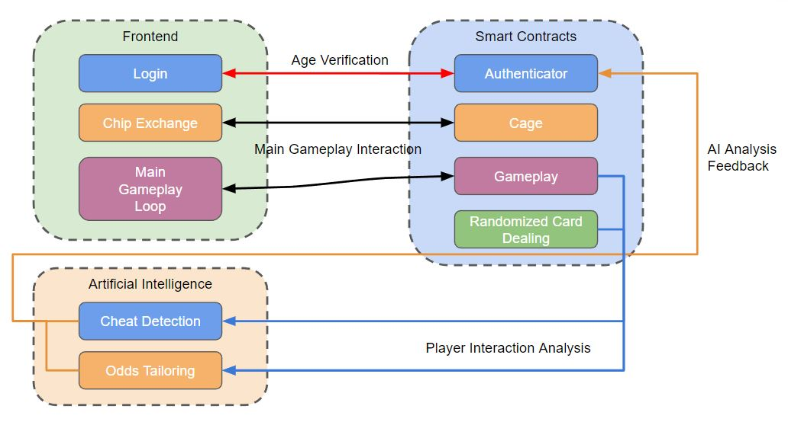
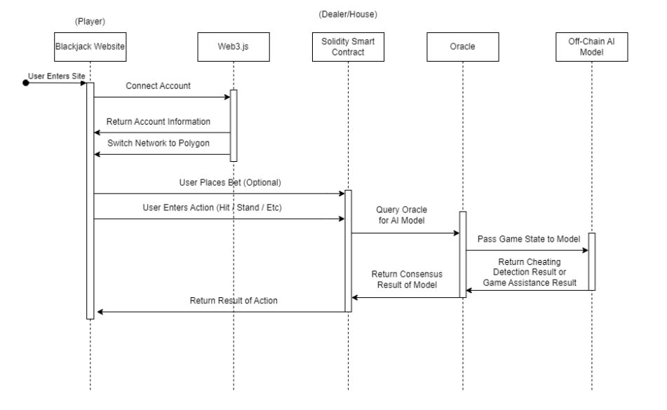
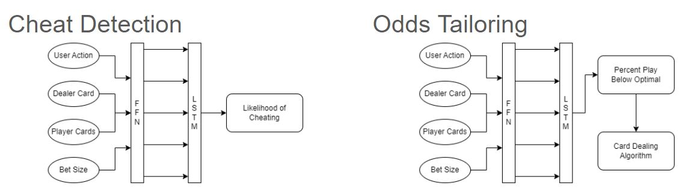
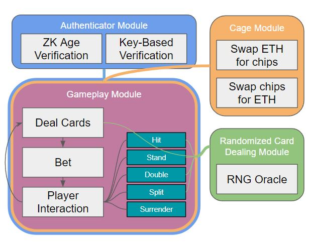

# F23_Decentralized_Blackjack

**Team Members**
- Matthew Cirimele
- Matthew Uryga
- Sean Hung
- Yu-Kai "Steven" Wang

**Project Description**

In a traditional setting (a casino), players have to blindly trust that the house is playing fairly. Not to mention that players would have to also present their IDs for age verification, risking their personal information. By leveraging the immutability and transparency of blockchain, a provably fair game can be made.  The integration of AI algorithms also allows for cheating detection and real-time player analysis to keep users engaged.

**Architecture**

**Sequence**

**AI Architecture**

**Blockchain (Smart Contract) Architecture**
