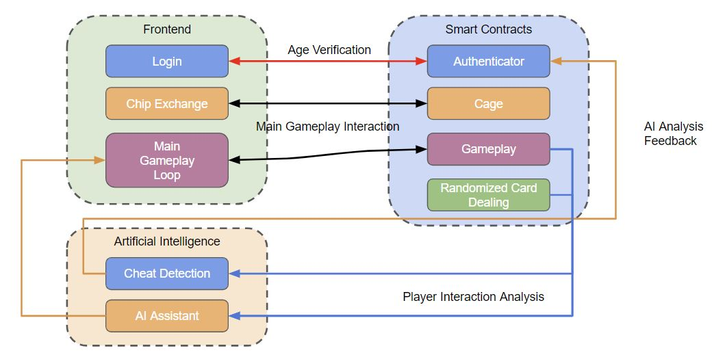
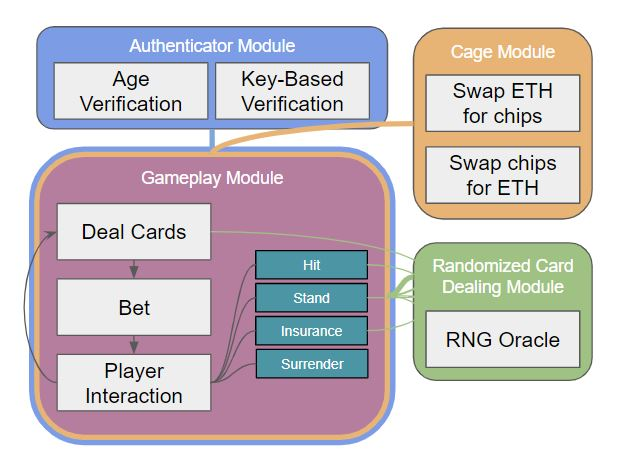

# F23_Decentralized_Blackjack

**Team Members**
- Matthew Cirimele
- Matthew Uryga
- Sean Hung
- Yu-Kai "Steven" Wang

**Running the Project**
On remix, clone the project and compile contracts under the `contracts` folder.
Next, connect your metamask with at least 0.8 Sepolia testnet ETH, and run `./scripts/deploy.js` on the IDE to deploy to the Sepolia test net.

**Project Description**

In a traditional setting (a casino), players have to blindly trust that the house is playing fairly. Not to mention that players would have to also present their IDs for age verification, risking their personal information. By leveraging the immutability and transparency of blockchain, a provably fair game can be made.  The integration of AI algorithms also allows for cheating detection and real-time player analysis to keep users engaged.

**Architecture**

**Sequence**

**AI Architecture**

**Blockchain (Smart Contract) Architecture**

